# Does Knowledge Affect Quality of Life?
- Dave Sadovy
- 10/30/2022
- Individual Project Part A

## Motivation
Many people believe in knowledge for its own sake.  That is, there is value in learning about the world around us, even if the knowledge gained does not produce any practical results.  Knowledge is not simply a means to an end - it is an end in itself!  Those who embrace this philosophy are often life-long learners.  Pursuing education provides them with both enjoyment and a sense of fulfillment.  But beyond personal satisfaction, does knowledge impact quality of life?

This study will examine possible relationships between knowledge and quality of life.  Specifically, we will try to determine if knowledge is associated with either health or wealth.  The results may inform strategies for improving quality of life.  Knowledge will be approximated by the average years of total schooling a person has attained by age 64.  Quality of life will be represented by two factors: life expectancy will serve as a proxy for health, while GPD per capita will stand in for wealth.    

## Data Source and Selected Indicators
The source of the data and accompanying graphs is [The World Development Explorer](https://www.worlddev.xyz).  

Definitions of the indicators used for this study:
1.  **Barro-Lee: Average years of total schooling, age 60-64, total.**  Average years of total schooling, 60-64, total is the average years of education completed among people age 60-64.  
2.  **Life expectancy at birth, total (years).**  Life expectancy at birth indicates the number of years a newborn infant would live if prevailing patterns of mortality at the time of its birth were to stay the same throughout its life.
3.  **GDP per capita, PPP (current international $).**  This indicator provides per capita values for gross domestic product (GDP) expressed in current international dollars converted by purchasing power parity (PPP) conversion factor.   GDP is the sum of gross value added by all resident producers in the country plus any product taxes and minus any subsidies not included in the value of the products. conversion factor is a spatial price deflator and currency converter that controls for price level differences between countries. Total population is a mid-year population based on the de facto definition of population, which counts all residents regardless of legal status or citizenship.

Since the more prosperous countries of the world have the luxury to apply more resources towards the pursuit of knowledge, this study will look specifically at the G7 nations: Canada, France, Germany, Italy, Japan, the United Kingdom, and the United States.  (Note: An initial examination was done of the G8, which includes Russia along with the G7.  However, Russia proved to be an outlier in several important metrics, so they have been excluded from this investigation.)  This selection of nations has the additional advantage of representing three of the world's seven regions: East Asia & Pacific, Europe & Central Asia, and North America.  Data for the selected indicators for the G7 is available for the period from 1990 to 2010, so the research will be limited to those years.

## Indicators by G7 Nations in 2010

### Average Years of Schooling
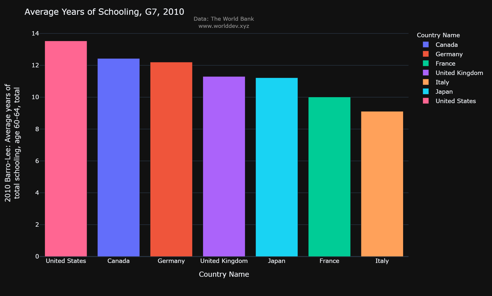

The data ranges from a low of 9.11 years of schooling in Italy to a high of 13.53 years in the United States, with an average of 11.4.  This range of over 4 years is relatively large.  Note also that the top two nations are in North America.

### Life Expectancy
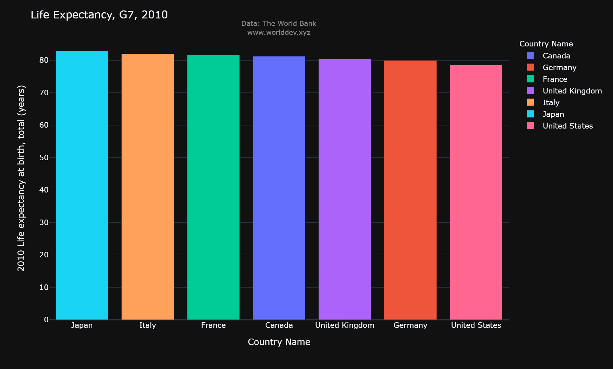

Life Expectancies range from a low of 78.54 years in the United States to a high of 82.84 years in Japan.  The average across the G7 is 80.96 years.  Life expectancies are fairly consistent, with a range of 4.3 years, slightly less than the range in schooling years.

### GDP Per Capita
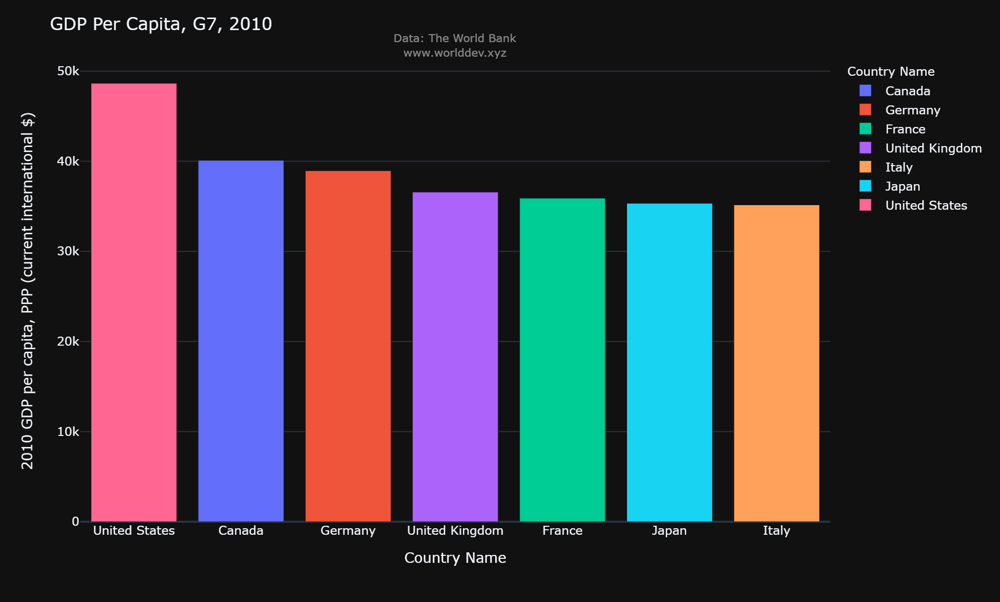

Italy has the lowest GPD per capita at $35,158, while the United States has the highest at $48,650.  The average is $38,668.  Once again the top two are the North American nations.  The United States' GDP per capita is nearly $10,000 above the G7 average.

Examining these three bar graphs, it is interesting to note that France, Italy, and Japan are the bottom three in both Average Years of Schooling and GDP Per Capita, while they are the top three in Life Expectancy.  

## Indicators by G7 Nations from 1990-2010

### Average Years of Schooling
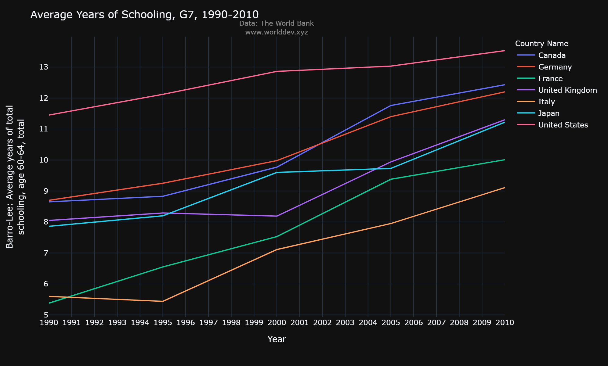

Here we see that the United States has maintained a significant advantage over the entire period, while France and Italy have remained at the bottom. The slopes of each line are relatively constant with a few notable exceptions.  Italy's numbers declined from 1990 to 1995 before beginning a steady rise.  The only other decrease is schooling was in the United Kingdom from 1995 to 2000, which was also followed by a steady rise.  

### Life Expectancy
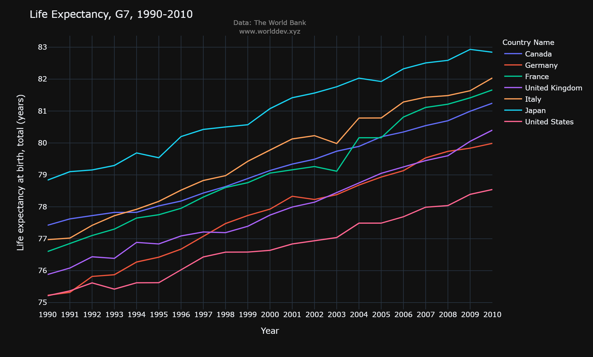

Japan's life expectancy has exceeded the rest of the G7 for the entire time period under study.  The United States has consistently held the bottom spot, with the gap widening.  

### GDP Per Capita
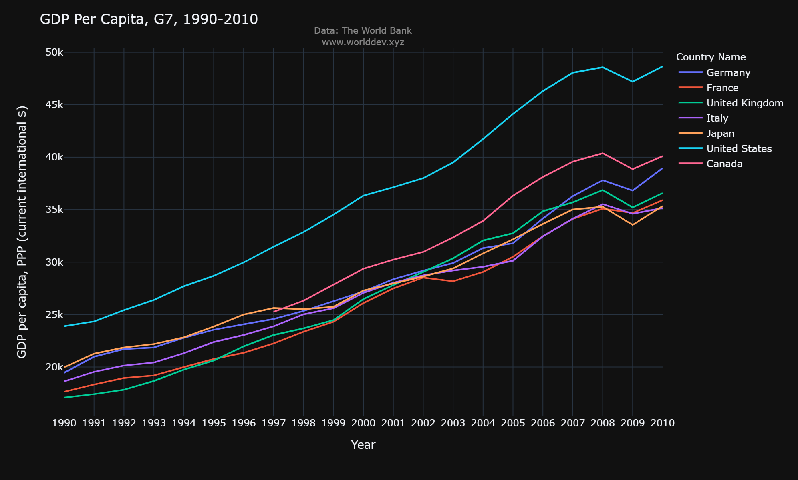

The United States has held a strong lead in GDP per capita for the entirety of these two decades.  All seven nations seem to be steadily increasing at roughly the same pace, with the notable exception of the Global Financial Crisis of 2008.  

## The Impact of Knowledge on Quality of Life

### Average Years of Schooling vs. Life Expectancy
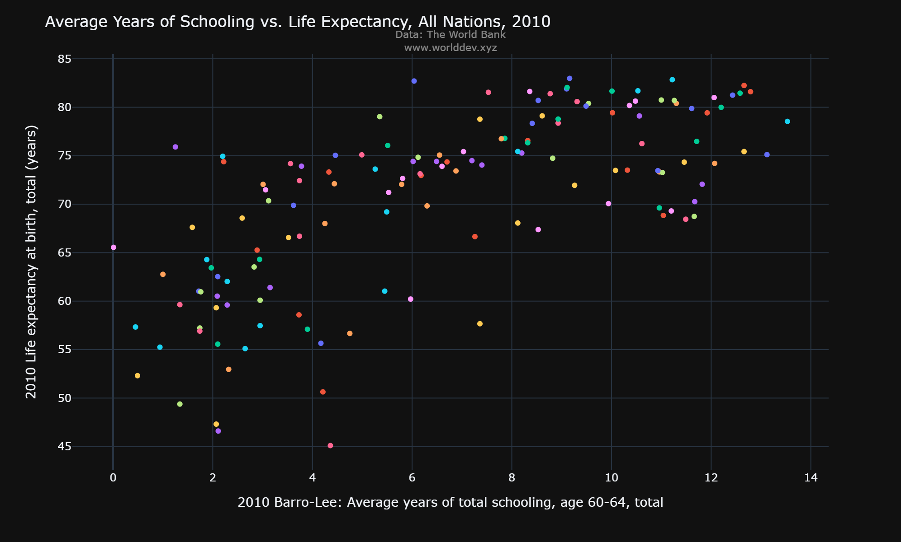

This scatter plot comparing average years of total schooling with life expectancy for all nations (not just the G7) in 2010 seems to suggest that people with more education live longer, though the correlation does not seem very strong.

### Regression - Average Years of Schooling vs. Life Expectancy
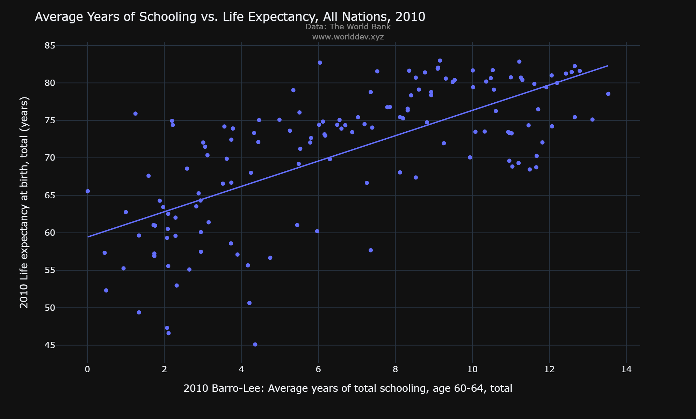

This regression shows the correlation between average years of total schooling and life expectancy.  A very rough estimate is that life expectancy increases about 5 years for every additional 3 years of schooling, though there is a great deal of variation.  

### Average Years of Schooling vs. GDP Per Capita
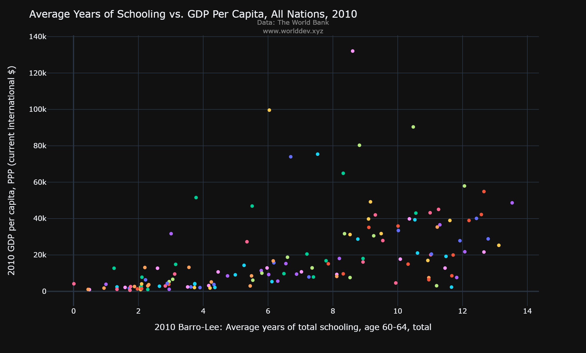

Again looking at all nations, this scatter plot shows a relationship between schooling and GDP per capita.  More educated nations tend to be wealthier.

### Regression - Average Years of Schooling vs. GDP Per Capita
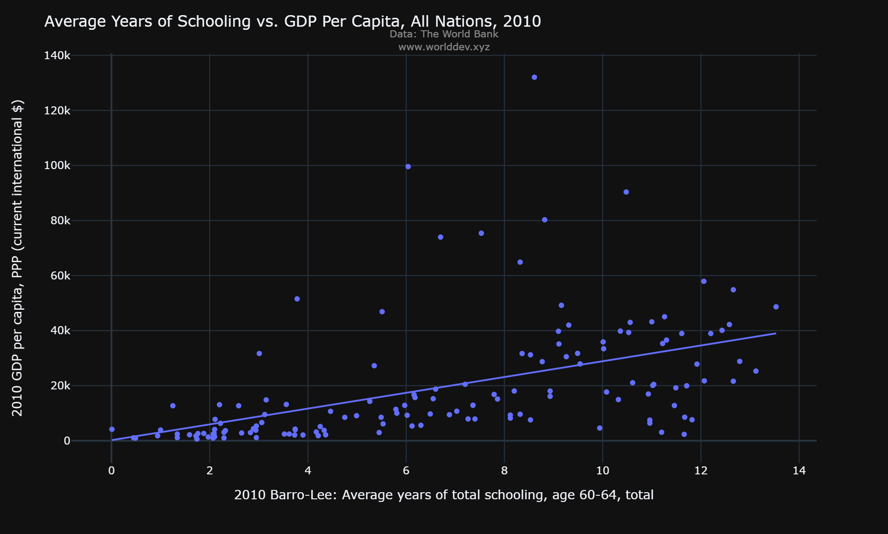

It appears that 1 year of schooling is associated with $3,000 in GPD.  There is much less variation in this scatter plot, indicating a stronger correlation.

## Conclusion
It seems clear from the scatter plots and regression plots for the 142 nations with data available that knowledge *is* correlated with both health and wealth.  The data on the G7 supports the correlation between knowledge and wealth, but not the correlation between knowledge and health.  It seems likely that this is due to the small sample size of the G7, along with the fact that these seven wealthy nations are near the top in both education and life expectancy.  

While we can be fairly confident that knowledge is associated with greater health and wealth, we can say nothing about causation without further study.  It may be tempting to conclude, for example, that more educated people are able to earn more money, so knowledge creates wealth.  But perhaps wealth provides people the freedom to continue their education for a longer period of time, in which case we would conclude that wealth creates knowledge.  It does seem likely that more educated people may better understand how to live healthier, suggesting that knowledge increases health.  However, it seems more likely that there is a lurking variable (perhaps wealth?) that is a significant contributor to both education and health.  Clearly these three indicators have a complex interrelationship, and are undoubtedly influenced by additional factors.

In this study we may also rely on the anecdotal evidence from our life experiences to support our conclusions.  People learn that smoking causes cancer, so they quit smoking.  Diabetics learn how to manage their blood sugar, so they avoid health complications.  Studies show that seatbelts save lives, so seatbelt laws are passed and traffic fatalities decrease.  In these and many other cases, increased knowledge causes increases health.  Similarly, higher levels of education are well-known to open doors to higher-paying jobs.  Nothwithstanding extreme outliers like Elon Musk and other billionaires, workers with PhDs or MDs earn more than those with Master's degrees, who earn more than those with Bachelor's degrees, who earn more than those with high school diplomas.  So we can see how increased knowledge causes increased wealth.  Again, the exact causal relationships betweeen knowledge, health, and wealth are undoubtedly complex, but experience provides strong support to the conclusions of our study.

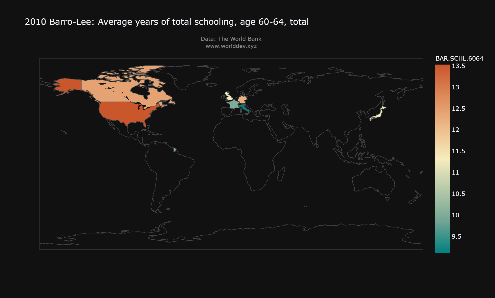
